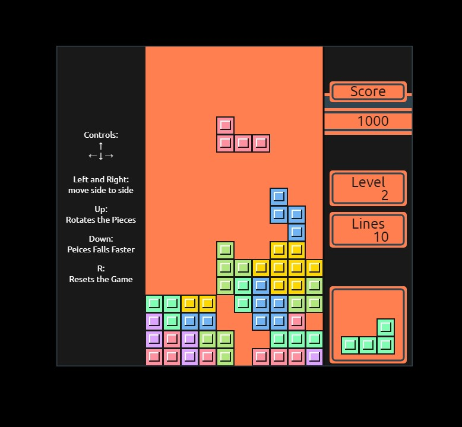

# [Tetris Game](https://deadpoolpv.github.io/)

This repository contains a homebrew Tetris game.

### About the Project:
This project is a tribute to the classic Tetris game, implemented for the Game Boy. It offers a faithful recreation of the core gameplay mechanics with a touch of nostalgia.

### Features:
Classic Tetris gameplay: Rotate and place Tetriminos (falling blocks) to complete lines and score points. 
Level system: Difficulty increases as you clear lines faster, with faster falling Tetriminos. 
Scoring system: Points are awarded based on the number of lines cleared at once. 
Game over: The game ends when Tetriminos reach the top of the playfield. 

### Controls:
&nbsp;&nbsp;&nbsp;&nbsp;↑ 
← ↓ →

Left and Right: move side to side 
Up: Rotates the Pieces 
Down: Peices Falls Faster 
R: Resets the Game 

### Additional Notes:
Feel free to modify the source code to customize various aspects of the game, such as difficulty levels, scoring system, or even add new features.
Consider including comments within the code to improve readability and maintainability.

### Contributing
If you're interested in contributing to this project, feel free to fork the repository and submit pull requests for your changes. We welcome bug fixes, enhancements, and new ideas!
